# ⏰ MP3 Alarm Clock

**A tiny desktop alarm clock that plays an MP3 — or your own recorded voice — at a scheduled time, keeps your computer awake, and wakes it from sleep when the alarm is due.**

Single Python file · macOS / Windows / Linux · starts with a double-click · the whole folder is portable.


---

## Screenshots

**The main window.** Big clock and next-alarm countdown in the header, plain-language status pills, your alarms on the left, one alarm in three steps on the right.

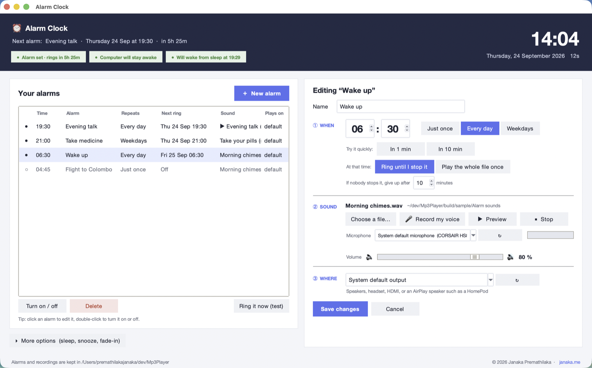

**When it rings.** A dark alert on top of everything with the time, the alarm name, a big red STOP and a Snooze button.

<p align="center">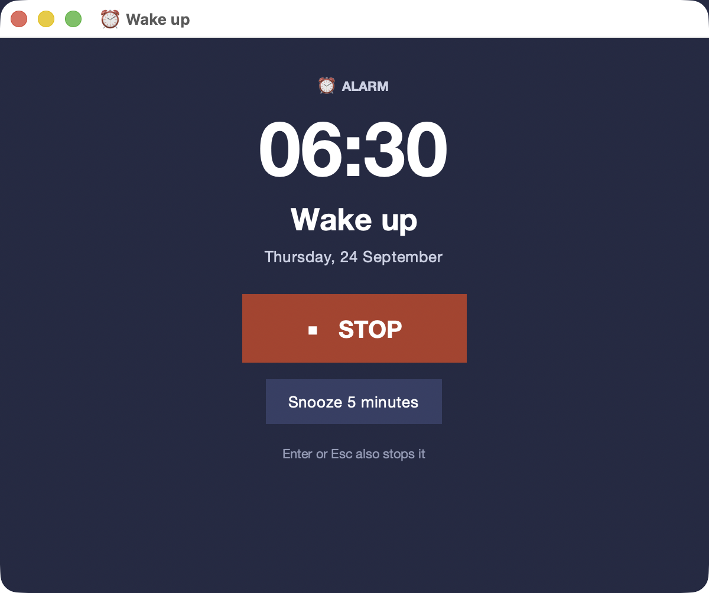</p>

## Why

Phone alarms are fine until you want *that* song, at full volume, through real speakers, at a specific date — or a message in your own voice ("get up, the flight is at nine"). This app does exactly that and nothing else.

## Features

| | |
|---|---|
| 🎵 **Any sound** | MP3, WAV, OGG, FLAC, AIFF (and M4A where the system can decode it) — pick a file, or **record from the microphone** and use the recording as the alarm. Quiet mics are **auto-boosted** to a healthy level, and the app warns while recording if the chosen mic is picking up nothing |
| 📅 **Real scheduling** | Date + time (24 h), repeat **once / every day / weekdays**, unlimited alarms |
| ▶ **Long recordings** | Each alarm either **rings until you stop it** (looping, with a give-up timeout) or **plays the whole file once** — a two-hour talk or a full album starts on time, keeps the computer awake while it plays, and stops by itself at the end |
| 🔊 **Volume you control** | Per-alarm volume, **fade-in** over N seconds, optional "turn the system volume up" when ringing |
| 🔈 **Output per alarm** | Each alarm picks its **own output device** — bedroom speakers for the wake-up, headset for the meeting reminder. Falls back to the system default (and says so) if the device is unplugged |
| 📡 **AirPlay (macOS)** | Alarms can play on **HomePod, Apple TV or any AirPlay speaker** — the same devices you pick in the Mac's Sound menu. Routed through the Music app; if the speaker is offline the alarm still rings on the Mac |
| 😴 **Sleep-proof** | Keeps the computer awake while an alarm is armed; optionally registers a **real OS wake** one minute before the alarm (macOS `pmset`, Windows wake timer, Linux `rtcwake`) |
| ⏱ **Catch-up** | If the machine was asleep at alarm time, it rings as soon as it wakes (up to 30 min late); older alarms are reported as *missed*, never silently dropped |
| 🛑 **Big red STOP** | One click, or Enter / Esc. Snooze with one click. Ring timeout so a forgotten alarm doesn't play forever |
| 👀 **Honest status** | Always-visible pills: *alarm set + countdown* · *computer will stay awake* · *will wake from sleep at …* (or exactly why not, with a *Try again* button) |
| 🧠 **Sensible defaults** | New alarm = next round hour, last sound, last volume. "Save alarm" with zero edits is a valid alarm |
| 📦 **Portable** | Everything (`alarms.json`, `recordings/`, `alarmclock.log`) lives next to the app. Copy the folder anywhere |

---

# User manual

1. [Install and start](#1-install-and-start)
2. [The window at a glance](#2-the-window-at-a-glance)
3. [Set an alarm in three steps](#3-set-an-alarm-in-three-steps)
4. [Record your own voice](#4-record-your-own-voice)
5. [Play a whole file once (talks, albums)](#5-play-a-whole-file-once-talks-albums)
6. [When the alarm rings](#6-when-the-alarm-rings)
7. [Manage your alarms](#7-manage-your-alarms)
8. [More options](#8-more-options)
9. [What the status pills mean](#9-what-the-status-pills-mean)
10. [Sleep, wake-up and missed alarms](#10-sleep-wake-up-and-missed-alarms)
11. [AirPlay speakers (macOS)](#11-airplay-speakers-macos)
12. [Where your data lives](#12-where-your-data-lives)
13. [Troubleshooting](#13-troubleshooting)
14. [Questions people ask](#14-questions-people-ask)

## 1. Install and start

### The easy way: double-click

| OS | Double-click this | Needs |
|---|---|---|
| macOS | `Start Alarm Clock.command` | [Python 3](https://www.python.org/downloads/mac-osx/) (the python.org installer includes Tk) |
| Windows | `Start Alarm Clock.bat` | [Python 3](https://www.python.org/downloads/windows/) with *Add to PATH* ticked during installation |
| Linux | `start_alarm_clock.sh` | `python3 python3-venv python3-tk libportaudio2` |

**The first run takes about a minute.** The launcher creates a private `.venv` folder next to the app and downloads the two libraries it needs (`pygame-ce` for playback, `sounddevice` for the microphone). A terminal window shows *First run: setting up…* while this happens. Every run after that opens instantly. If the environment ever breaks (for example after a Python upgrade), the launcher notices and rebuilds it by itself.

- **macOS:** the first time, right-click `Start Alarm Clock.command` → **Open** if macOS says it is from an unidentified developer. If you get *"Python 3 with Tk is required"*, install Python from python.org (the Homebrew build often has no Tk).
- **Windows:** if a black window flashes and closes, Python is probably not on the PATH. Re-run the Python installer and tick *Add python.exe to PATH*.
- **Linux:** install the packages above with your package manager first, e.g. `sudo apt install python3 python3-venv python3-tk libportaudio2`.

### Alternative: a standalone app (no Python needed on the target machine)

```bash
./build_standalone.sh          # → dist/Alarm Clock.app  (macOS)  or  dist/Alarm Clock/Alarm Clock.exe  (Windows)
```

Copy the result anywhere; the data files are created next to it. An unsigned app downloaded from the internet gets Gatekeeper's warning once — right-click → **Open**.

### Alternative: run it like a developer

```bash
python3 -m venv .venv && .venv/bin/pip install -r requirements.txt
.venv/bin/python alarm_clock.py
```

### What you see the first time

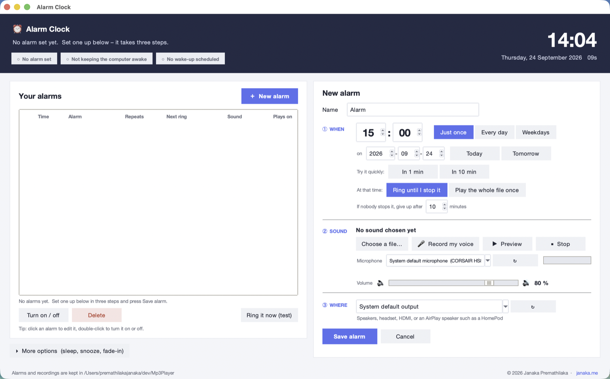

The list is empty and the editor on the right already holds a usable new alarm: **today, at the next round hour, just once**. The three grey pills in the header say *No alarm set · Not keeping the computer awake · No wake-up scheduled*. Nothing happens until you save an alarm.

## 2. The window at a glance

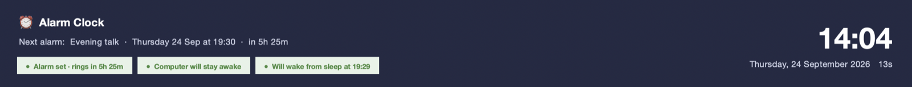

| Area | What it shows |
|---|---|
| **Header, left** | The name of the next alarm, when it rings and a live countdown. Below it, three **status pills** that always tell the truth about *right now*: is an alarm set, will the computer stay awake, will it wake from sleep (see [section 9](#9-what-the-status-pills-mean)). |
| **Header, right** | A big clock with the date and seconds, so you can check the computer's time is right. |
| **Your alarms** (left card) | Every alarm with its time, name, repeat rule, **next ring** time, sound file and output device. A filled dot ● means on, a hollow dot ○ means off. Below the list: *Turn on / off*, *Delete* and *Ring it now (test)*. |
| **More options** (under the list) | Collapsed by default. Sleep and wake settings, system volume, snooze length and fade-in (see [section 8](#8-more-options)). |
| **Editor** (right card) | One alarm at a time, in three numbered steps: ① When ② Sound ③ Where, then **Save alarm**. |
| **Footer** | Where your alarms and recordings are stored. |

The window can be resized; the alarm list grows and shrinks, the editor keeps its width.

## 3. Set an alarm in three steps

Press **＋ New alarm** (or just use the form that is already there), fill in the three steps, press **Save alarm**. You can save immediately without changing anything: the defaults are today, the next round hour, and the sound and volume of the last alarm you saved.

<p align="center">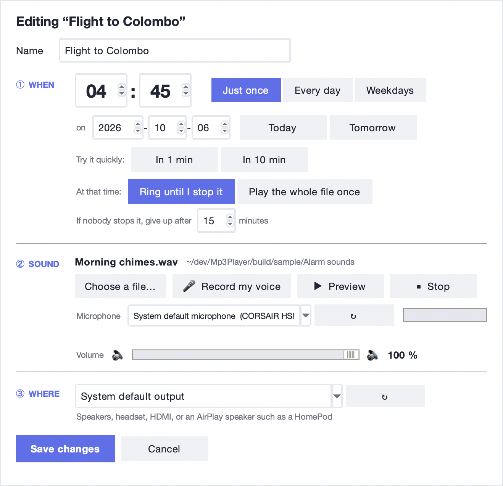</p>

**Name** — anything you like ("Wake up", "Take medicine", "Call mum"). It is shown in the list and, in big letters, on the alert when the alarm rings. Leave it empty and it is called "Alarm".

### ① When

- **Time:** two big fields, hours (00–23) and minutes (00–59). Type a number or use the arrows; the fields wrap around. Times are always 24-hour.
- **Repeat:**
  - **Just once** — rings on the chosen date, then switches itself off. A date row appears: year-month-day, plus **Today** and **Tomorrow** shortcuts. A date and time in the past cannot be saved; the app tells you.
  - **Every day** — rings daily at that time. No date is needed, so the date row disappears.
  - **Weekdays** — Monday to Friday only.
- **Try it quickly:** **In 1 min** and **In 10 min** set the date and time relative to now. Use them to hear an alarm for real, exactly as it will ring (fade-in, system volume, chosen speaker).
- **At that time:** what should happen when the moment comes.
  - **Ring until I stop it** — the usual alarm. The sound loops until you press STOP or Snooze. *If nobody stops it, give up after N minutes* (1–120, default 10) so a forgotten alarm does not play all day.
  - **Play the whole file once** — for long recordings; see [section 5](#5-play-a-whole-file-once-talks-albums).

### ② Sound

- **Choose a file…** opens a normal file dialog. Supported: MP3, WAV, OGG, FLAC, AIFF (M4A if your system can decode it). The file name and its folder appear above the buttons. If the file is later moved or deleted the label says *file not found* and the alarm will show an error when it is due, so keep alarm sounds in a fixed place (the `recordings` folder next to the app is a good one).
- **🎤 Record my voice** records a message from the microphone; see [section 4](#4-record-your-own-voice).
- **▶ Preview** plays the chosen sound once, at the slider volume, on the speaker chosen in step ③ — with no fade-in, so you hear the real level. **■ Stop** stops it.
- **Microphone** — which input to record from; **↻** refreshes the list after plugging one in. The bar to the right is the level meter that moves while you record.
- **Volume** — the alarm's own volume, 0–100 %. It is applied on top of the system volume (see *More options* for forcing the system volume up as well).

### ③ Where

<p align="center">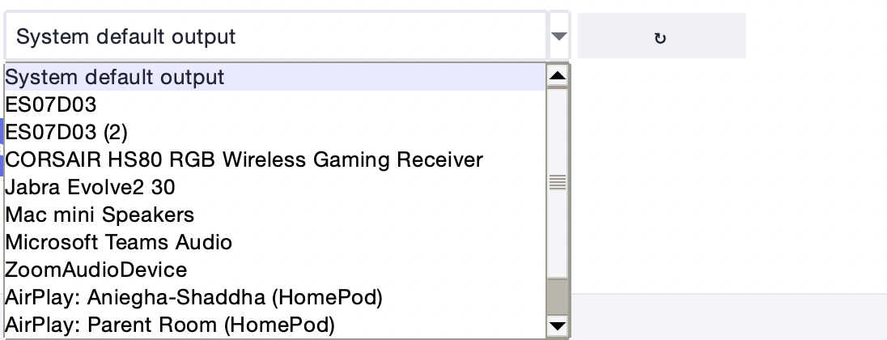</p>

- **System default output** follows whatever the computer is using at that moment (the safe choice).
- Every connected output is listed by name: built-in speakers, a headset, HDMI, USB speakers, a Bluetooth box. **↻** refreshes the list.
- On a Mac, **AirPlay speakers** such as HomePods are listed too; see [section 11](#11-airplay-speakers-macos).
- If the chosen device is unplugged when the alarm is due, the alarm rings on the system default instead and the editor says so. In the editor, such a device is shown as *(not connected)* until you plug it back in.

### Save

Press **Save alarm** (it reads **Save changes** when you are editing an existing alarm). The alarm appears in the list, the header shows the countdown and the pills turn green. **Cancel** throws away unsaved edits and returns to a fresh new alarm.

## 4. Record your own voice

1. Pick the microphone in step ② (usually *System default microphone*).
2. Press **🎤 Record my voice**. The button turns into **■ Stop**, the level meter starts moving and the line below counts the seconds and shows the peak level.
3. Speak your message. Press **■ Stop** when done.
4. The recording is saved as a WAV file in the `recordings` folder next to the app (named `voice_<date>_<time>.wav`) and is selected as this alarm's sound straight away. Press **▶ Preview** to hear it, then **Save alarm**.

What the line under the microphone tells you after you stop:

| Message | Meaning |
|---|---|
| *Saved voice_….wav (level 43%)* | Good take. |
| *Saved – was quiet (6%), boosted +18 dB* | You were far from the mic; the app raised the recording to a healthy level automatically. It still works. |
| *Almost nothing was recorded* (plus a warning box) | The mic picked up silence. Wrong microphone chosen, a mute switch on the headset, or the app has no microphone permission. Choose another mic in the list and try again. |

<p align="center">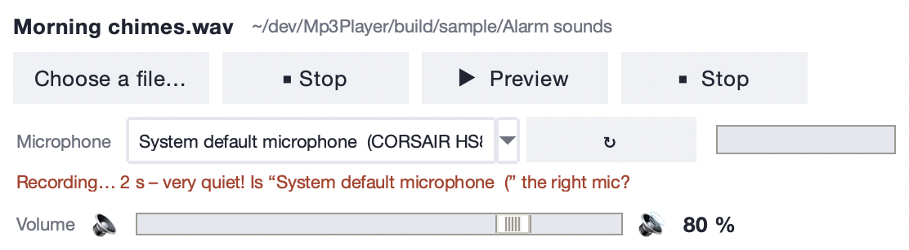</p>

While recording, if nothing is coming in for two seconds the line turns red: *very quiet! Is "…" the right mic?* — check the mic before you waste a minute talking to the wrong one.

**Microphone permission on macOS.** The first recording makes macOS ask whether the app may use the microphone. The question is addressed to the program that started the alarm clock: *Terminal* when you use `Start Alarm Clock.command`, or *Alarm Clock* itself when built standalone. If you clicked *Don't Allow*, or a recording comes out silent, open *System Settings → Privacy & Security → Microphone* and switch it on.

## 5. Play a whole file once (talks, albums)

Some things are not meant to loop: a two-hour talk, a sermon, a guided meditation, an album to fall asleep to. For those, in step ① choose **Play the whole file once**.

<p align="center">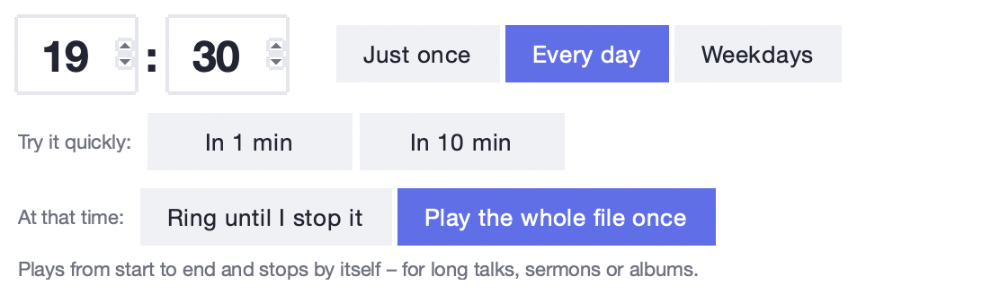</p>

- The file starts at the alarm time and plays from beginning to end, then stops by itself. There is no give-up timeout and no snooze.
- The computer is kept awake for the whole duration (as long as *Keep my computer awake* is on in More options).
- Instead of the loud alert you get a calm **Now playing** card. It is *not* pinned on top of other windows and does not steal your keyboard focus, so you can keep working. It shows how long the file has been playing and closes itself at the end. STOP (or Enter / Esc in that window) stops early.
- In the alarm list such alarms show a ▶ in front of the sound name, and *Playing now* in the *Next ring* column while they play.

<p align="center">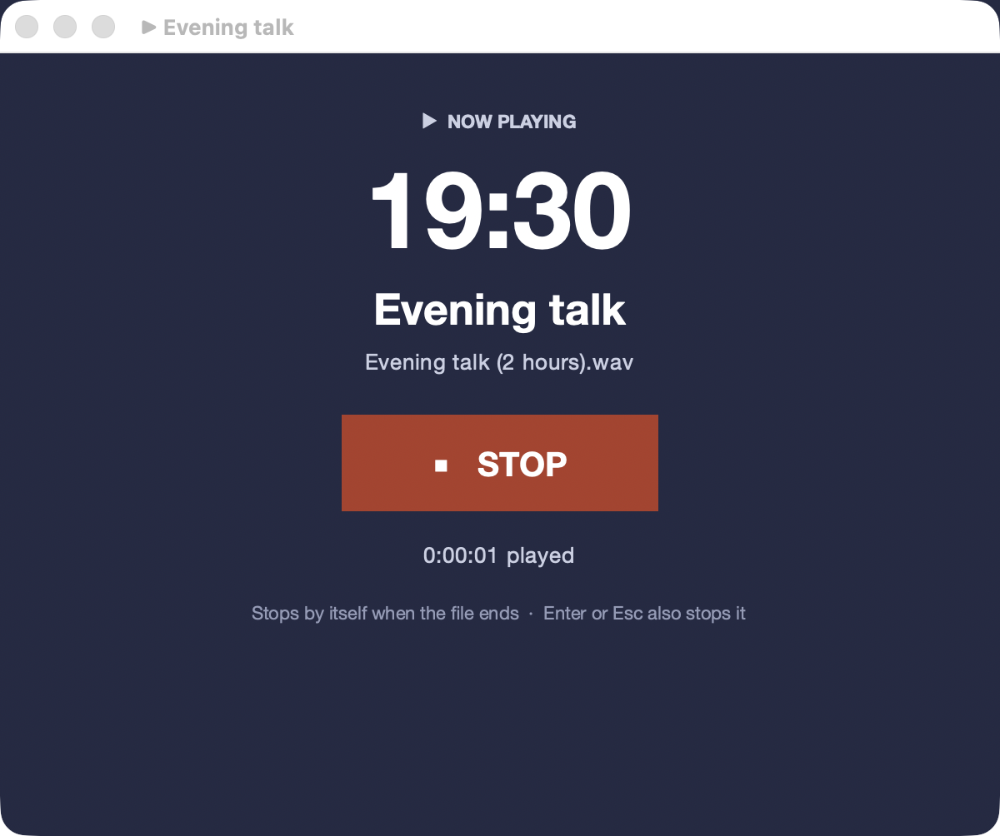</p>

## 6. When the alarm rings

<p align="center">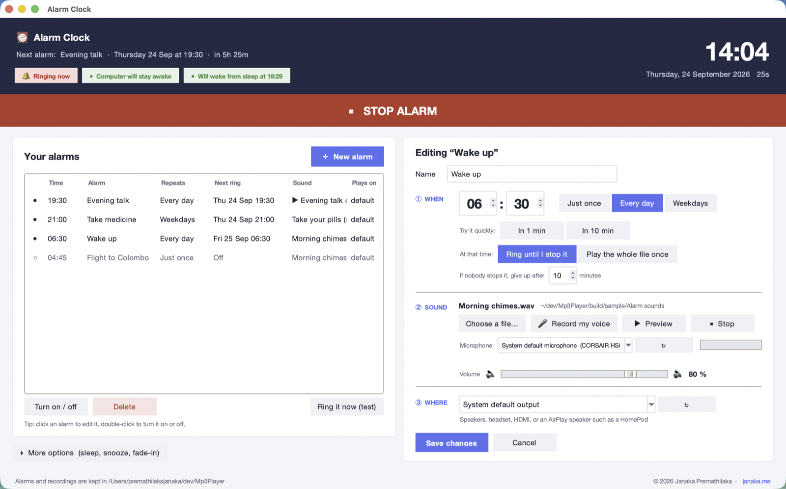</p>

At the alarm time:

1. The sound starts on the chosen speaker. If fade-in is on (default 20 s) it starts silent and rises to the alarm volume, so you are not jolted awake. If *Turn the system volume up* is on, the computer's own volume is set first (and un-muted).
2. A dark **alert window** appears on top of everything, with the time, the alarm name and the date.
3. The main window comes forward, shows a red **STOP ALARM** bar and the first pill turns red: *🔔 Ringing now*.

**To stop it:** click the big red **STOP** in the alert, click the **STOP ALARM** bar in the main window, or press **Enter** or **Esc** while the alert has focus. Closing the alert window with its close button also stops it.

**To snooze:** click **Snooze N minutes** (N is set in More options, default 5). The alert closes, the sound stops and the header counts down to the snoozed ring:

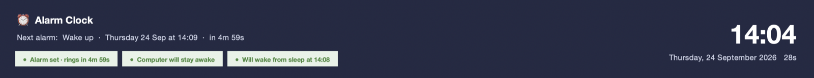

The snooze is temporary; it is not saved as a new alarm and it does not change the alarm's real schedule.

**If nobody stops it**, the alarm gives up after the *give up after N minutes* you set in step ①. This is written to the log.

**Several alarms at once** each get their own alert window; STOP in one window stops that alarm only, the red bar in the main window stops everything.

**One-time alarms** switch themselves off after ringing (the dot in the list turns hollow and *Next ring* shows *Off*). Repeating alarms stay on.

## 7. Manage your alarms

The list on the left shows every alarm, sorted so the next one to ring is at the top; switched-off alarms sit at the bottom in grey.

| Action | How |
|---|---|
| **Edit** an alarm | Click it. It loads into the editor on the right; change anything and press **Save changes**. |
| **Turn it on or off** | Double-click the row, or select it and press **Turn on / off**. Off alarms keep all their settings. |
| **Delete** | Select it and press **Delete** (asks for confirmation). |
| **Test it** | Select it and press **Ring it now (test)**. It rings exactly as it will at the real time — same speaker, same volume, same fade-in — including the alert and snooze. Its real schedule is untouched. |
| **Re-use a one-time alarm** that has already rung | Click it, set a new date (the **Tomorrow** button is handy) and press **Save changes**; saving turns it on again. |
| **Preview a sound only** | In the editor, **▶ Preview** plays the file without any alert. |

The *Next ring* column, the header countdown and the *Alarm set* pill always agree; they are all computed from the same schedule.

## 8. More options

Press **▸ More options (sleep, snooze, fade-in)** under the alarm list to open this panel. Changes are saved immediately; there is no OK button.

<p align="center">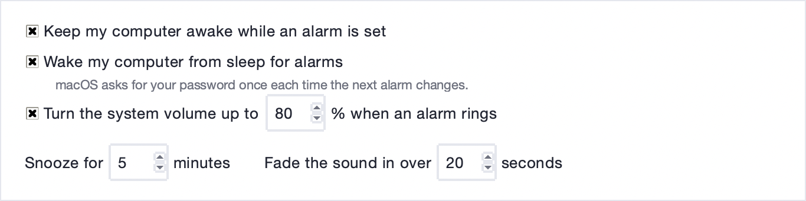</p>

| Setting | Default | What it does |
|---|---|---|
| **Keep my computer awake while an alarm is set** | on | Stops the computer from going to sleep on its own while any alarm is armed or a file is playing. Needs no password. The screen may still dim or lock; that is fine, the alarm rings anyway. |
| **Wake my computer from sleep for alarms** | on | If you (or the lid) put the computer to sleep anyway, the app asks the operating system to wake it **one minute before** the next alarm. On macOS this needs your password once each time the next alarm changes; see [section 10](#10-sleep-wake-up-and-missed-alarms). |
| **Turn the system volume up to N % when an alarm rings** | on (macOS), off elsewhere | Sets the computer's master volume to N (Windows: raises it) and un-mutes it just before ringing, so an alarm cannot be silenced by a volume knob you forgot about. Not used for AirPlay speakers (they have their own volume). |
| **Snooze for N minutes** | 5 | Length of one snooze. 1–60. |
| **Fade the sound in over N seconds** | 20 | Ramp from silent to the alarm volume. 0 turns fading off (instant full volume). 0–120. Preview never fades. |

## 9. What the status pills mean

The three pills in the header describe the situation *right now*. Green ● is good, orange △ is a warning, red is a problem, grey ○ is "nothing to do".

| Pill | Meaning |
|---|---|
| **● Alarm set · rings in 7h 2m** | At least one alarm is on; the countdown is to the next one (including a snooze). |
| **○ No alarm set** | Nothing will ring. |
| **🔔 Ringing now** / **▶ Playing now** | An alarm is ringing, or a whole-file alarm is playing. |
| **● Computer will stay awake** | The keep-awake guard is active. |
| **△ Computer may fall asleep (option is off)** | An alarm is set but *Keep my computer awake* is switched off. If the computer sleeps, the alarm only rings if a wake-up is registered. |
| **△ Computer may fall asleep while playing (option is off)** | A whole-file alarm ([section 5](#5-play-a-whole-file-once-talks-albums)) is playing but *Keep my computer awake* is off, so idle sleep could cut it short. |
| **△ Could not keep the computer awake** | The guard failed (details in `alarmclock.log`). |
| **○ Not keeping the computer awake** | No alarm is set, so nothing to guard. |
| **● Will wake from sleep at 06:29** | The operating system has accepted the wake request (one minute before the alarm). |
| **… Setting up wake from sleep** | The request is in progress — on macOS the password dialog is probably open. |
| **△ Wake from sleep not set – password was declined** | You cancelled the password dialog. A **Try again** button appears; the app will *not* keep asking on its own. |
| **△ Wake from sleep could not be set** | The request failed for another reason (details in the log). **Try again** is offered. |
| **○ Wake from sleep is off** | The option is switched off in More options. |
| **○ Alarm is too soon to need a wake-up** | The alarm is less than a minute away; the computer is awake right now anyway. |
| **○ Wake from sleep is not available here** | Unsupported operating system. |
| **○ No wake-up scheduled** | No alarm is set. |

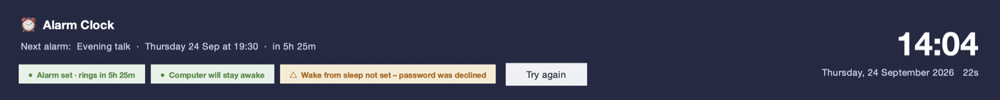

## 10. Sleep, wake-up and missed alarms

**The app must be running.** Alarms ring only while the window is open (it can be behind other windows or on another desktop). Closing it with an alarm armed asks *Quit anyway?* first.

**Two safeguards** work together:

| | macOS | Windows | Linux |
|---|---|---|---|
| **Keep awake** while an alarm is armed (no password) | `caffeinate` | `SetThreadExecutionState` | `systemd-inhibit` |
| **Wake from sleep** 1 min before the alarm | `pmset schedule wake` — asks for your password once each time the next alarm changes | a waitable timer with the resume flag — *wake timers* must be allowed in the power plan (default on desktops) | `rtcwake` via `pkexec` — asks for your password |

**The password dialog (macOS / Linux).** When you save or change an alarm, macOS asks for an administrator password so the wake-up can be registered. Enter it once; nothing more is asked until the *next* alarm time changes. If you cancel, the pill says *password was declined* and offers **Try again**; the app never nags. Without a registered wake-up the alarm still rings as long as the computer does not sleep (keep-awake takes care of that).

**Laptops with the lid closed** may "dark-wake" and stay silent, because macOS keeps the speakers off while the lid is shut. Leave the lid open, or plug in an external display, if the alarm must be heard.

**Catch-up.** If the computer was asleep or the app was not running at the alarm time, the alarm rings as soon as it is possible again, provided it is at most **30 minutes late**. Older than that, it is treated as **missed**: a message tells you *Alarm "…" was missed (it was due Thu 06:30 while the computer was off or asleep)* and a one-time alarm is switched off. Nothing is ever dropped silently; every decision is also written to `alarmclock.log`.

**Check the clock.** The header shows the computer's time and seconds; an alarm can only be as accurate as that.

## 11. AirPlay speakers (macOS)

In step ③ open the list and choose an **AirPlay: …** entry, or **AirPlay speakers… (select to load them from Music)** if none are listed yet (or press ↻). The app asks the Music app for the AirPlay devices it can see and lists them as `AirPlay: Living Room (HomePod)`. Pick one and save the alarm.

At ring time the app launches Music (it pre-launches it 3 minutes early), routes Music to that speaker, plays your file, fades the volume in, and when you press STOP it removes the temporary track and restores Music's previous speaker selection and volume.

- The first time, macOS asks whether the launcher (Terminal, or the standalone app) may control **Music** — click *Allow*. If you clicked *Don't Allow*, turn it on in *System Settings → Privacy & Security → Automation*.
- Speaker offline at ring time → the alarm rings on the Mac's default output and the editor says why.
- One AirPlay speaker per alarm (multi-room is on the wish list).
- **Preview** also plays through the AirPlay speaker, so you can test the whole chain.
- Windows / Linux: AirPlay entries are simply not offered.

## 12. Where your data lives

Everything is stored **next to the app**, never in your home folder:

| File | Contents |
|---|---|
| `alarms.json` | Your alarms and the settings from More options. Plain text; you can back it up or copy it to another machine. |
| `recordings/` | Voice recordings (`voice_2026-09-24_06-15-02.wav`). Also the default folder in *Choose a file…*. |
| `alarmclock.log` | What happened and when: alarms due, snoozes, missed alarms, wake requests, errors. Look here first when something is unclear. |
| `.venv/` | The private Python environment the launcher created. Safe to delete; it is rebuilt on the next start. |

**Moving to another computer:** copy the whole folder. Alarms whose sound files live *inside* the folder (recordings) keep working; alarms pointing to files elsewhere on the old machine will say *file not found* until you choose the file again.

## 13. Troubleshooting

| Problem | What to do |
|---|---|
| **Nothing happens when I double-click the launcher** | macOS: right-click → Open the first time. Windows: install Python with *Add to PATH*. Linux: `chmod +x start_alarm_clock.sh` and install `python3-tk libportaudio2`. |
| **"Could not install dependencies"** | No internet during the first run, or a proxy. Connect and double-click again. Details are in the terminal window. |
| **"Sound output is not available"** at start | No speakers or headphones connected, or the audio library did not install. Plug in an output device; if it persists, delete the `.venv` folder and start again. |
| **The alarm rang but I heard nothing** | Check the *Plays on* column: was the alarm sent to a headset that was unplugged, or an AirPlay speaker that was off? Use *Ring it now (test)*. Turn on *Turn the system volume up* in More options. Check the alarm's own volume slider. |
| **Preview works, the alarm is quiet at first** | That is the fade-in. Set *Fade the sound in over* to 0 for instant full volume. |
| **The recording is silent** | Wrong microphone chosen, headset mute switch on, or no microphone permission (macOS: *System Settings → Privacy & Security → Microphone*). |
| **"Almost nothing was recorded"** | Same causes as above; pick another microphone from the list and watch the level meter while you talk. |
| **The alarm did not ring while the computer was asleep** | Look at the wake pill *before* you go to bed: it must say *Will wake from sleep at …*. If it says the password was declined, press **Try again**. On a laptop keep the lid open. On Windows allow wake timers in the power plan. Read `alarmclock.log` afterwards: it records whether the wake was registered. |
| **"Alarm … was missed"** | The computer was off or asleep for more than 30 minutes past the alarm time and could not be woken. See the previous row. |
| **"That date and time is already in the past"** | A one-time alarm needs a future moment. Use **Tomorrow** or **In 1 min**. |
| **"The sound file for … is missing"** | The file was moved or deleted. Click the alarm, *Choose a file…* again, save. |
| **"… could not play <file>"** (when ringing) or **"Could not play <file>"** (Preview) | The file is damaged or in a format the player cannot decode. Convert it to MP3 or WAV. |
| **AirPlay speaker not listed** | Make sure it is on and on the same Wi-Fi, then press ↻ next to the list. The Music app must be allowed to be controlled (*Privacy & Security → Automation*). |
| **The password dialog keeps coming back** | It appears once per change of the next alarm time. Editing several alarms in a row triggers it each time; finish editing first, or turn *Wake my computer from sleep* off while you set things up. |
| **Something else** | Open `alarmclock.log` next to the app; every alarm, snooze, wake request and error is written there with a timestamp. |

## 14. Questions people ask

**Can I close the window and still get the alarm?** No. The app must stay open (minimised or behind other windows is fine). It warns you if you try to quit with an alarm set.

**Does it need the internet?** Only for the first run, to download the two libraries. After that it works offline.

**Does it work with the screen locked?** Yes. The alarm rings and the alert appears when you unlock. Enter or Esc stops it as soon as the alert has focus.

**Can I have different sounds and speakers per alarm?** Yes, every alarm has its own sound, volume and output device.

**How loud will it be?** The alarm's own volume slider, multiplied by the system volume. Turn on *Turn the system volume up to N %* to make the system part predictable.

**Is anything sent anywhere?** No. There is no account, no telemetry; everything stays in the folder.

**Can I edit alarms.json by hand?** Yes, while the app is closed. It is ordinary JSON.

---

## Project layout

```
alarm_clock.py              the whole app (core logic + tkinter GUI, ~1 900 lines)
requirements.txt            pygame-ce, sounddevice — that's all
Start Alarm Clock.command   macOS launcher      Start Alarm Clock.bat   Windows launcher
start_alarm_clock.sh        Linux launcher      build_standalone.sh     PyInstaller build
tests/test_logic.py         headless tests for scheduling (next_fire, grace, snooze, missed)
tools/make_screenshots.py   regenerates docs/screenshots/*.png from a throw-away sample alarms.json
.claude/                    Claude Code skills + proactive review agents used to build this
```

**Why pygame-ce and not pygame?** pygame 2.6 has no wheels for Python 3.14; pip silently builds it from source *without* the audio mixer. pygame-ce ships wheels for every current Python on all three platforms.

## Development

```bash
.venv/bin/python tests/test_logic.py      # scheduling logic
bash "Start Alarm Clock.command"           # GUI smoke test
.venv/bin/python tools/make_screenshots.py # refresh the manual's screenshots (macOS, needs Screen Recording permission)
```

Contributions welcome — the `.claude/skills/*.md` files double as the design notes (UX rules, power-management invariants, error-message style).

## License

MIT — see [LICENSE](LICENSE).

Made by [Janaka Premathilaka](https://janaka.me) — more at **[janaka.me](https://janaka.me)**.
